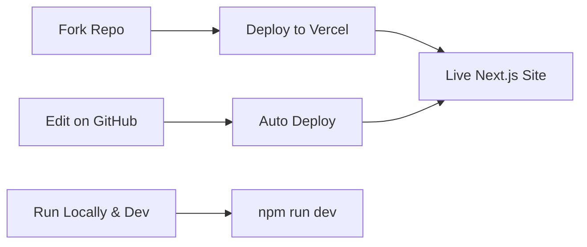

<div align="center">

# ⚡ Next.js Personal Portfolio Template

*High-performance portfolio built with Next.js 14 and modern web technologies*

[](https://vercel.com/new/clone?repository-url=https://github.com/MrShadowRIFAT/WHS9XNH-Personal_Portfolio_NextJS_Template)


**Built for speed. Styled for impact. Powered by Next.js.**

</div>

---

## ✨ Why This Project

Next.js 14 portfolio optimized for performance and SEO. Server-side rendering, API routes, and modern animations out of the box. Perfect for developers, designers, and creatives.

---

## 🔥 Features

⚡ **Next.js 14** – Latest framework with App Router  
🚀 **Server-Side Rendering** – SEO & performance optimized  
✨ **Framer Motion** – Smooth, advanced animations  
📱 **Responsive** – Works perfectly on all devices  
🎨 **Bootstrap 5** – Professional styling framework  
🔄 **Carousel Ready** – Swiper integration included  
📊 **API Routes** – Backend ready for contact forms  

---

## 🚀 Quick Setup

### 1️⃣ Fork Repository
```bash
# Click Fork button on GitHub
# Your own copy is ready
```

### 2️⃣ Deploy with Vercel
Press the button above → Connect GitHub → Deploy (instant!)

### 3️⃣ Local Development
```bash
git clone https://github.com/YOUR_USERNAME/WHS9XNH-Personal_Portfolio_NextJS_Template.git
cd WHS9XNH-Personal_Portfolio_NextJS_Template
npm install
npm run dev
# Open http://localhost:3000
```

---

## 📁 Project Structure

| Folder | Purpose |
|--------|---------|
| `src/app/` | Next.js 14 App Router pages |
| `src/components/` | Reusable React components |
| `public/` | Static assets, images, icons |
| `src/styles/` | CSS & styling |
| `src/lib/` | Utilities & helpers |
| `api/` | Backend API routes |

---

## 🧠 How It Works



---

## 🛠️ Tech Stack

<div align="center">


</div>

**Next.js 14** • **React 18** • **Bootstrap 5** • **Framer Motion** • **Swiper** • **RemixIcon**

---

## 📝 Customization

1. **Edit Pages** – Modify files in `src/app/`
2. **Update Content** – Change component text & data
3. **Replace Images** – Add your photos to `public/`
4. **Customize Styling** – Edit `src/styles/` CSS
5. **Add API Routes** – Create endpoints in `src/app/api/`

---

## 📦 Build & Deploy

```bash
# Dev server
npm run dev

# Build for production
npm run build

# Start production server
npm run start

# Run linter
npm run lint
```

| Platform | Deploy Time | Cost |
|----------|-------------|------|
| **Vercel** | 1 click | Free |
| **GitHub Pages** | 2 mins | Free |
| **Netlify** | 2 mins | Free |

---

## 📊 GitHub Stats

<div align="center">


</div>

---

## 👨‍💼 Author

**MrShadowRIFAT** | [🔗 rifat.website](https://rifat.website) | [📧 noreply@rifat.website](mailto:noreply@rifat.website)

---

<div align="center">

**[⭐ Star This Repo](#)** • **[🐛 Report Issue](#)** • **[💡 Suggest Feature](#)**

Made with ❤️ for next-generation portfolios

</div>